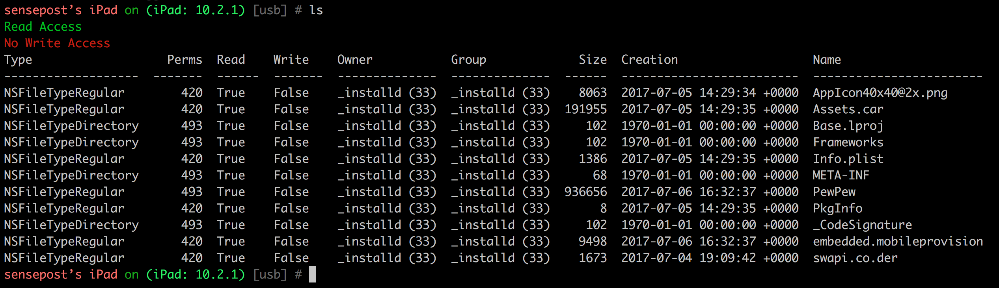
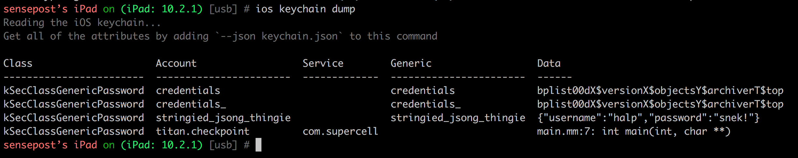
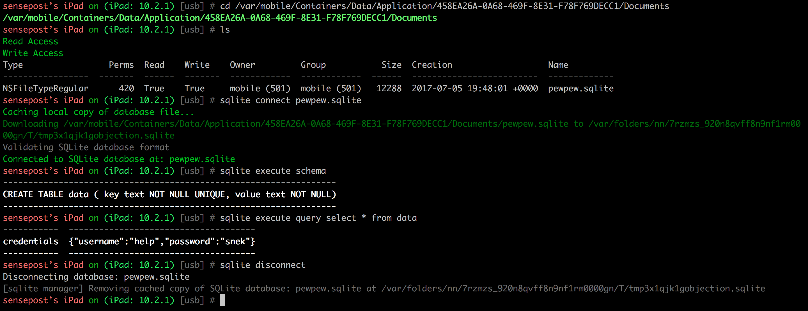
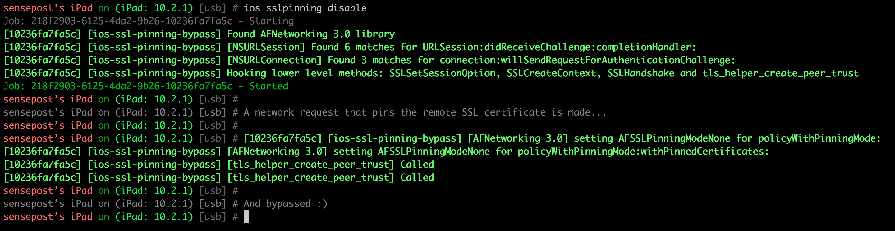

## introduction
`objection` is a runtime mobile exploration toolkit, powered by [Frida](https://www.frida.re/). It was built with the aim of helping assess mobile applications and their security posture without the need for a jailbroken or rooted mobile device.

The projects name quite literally explains the approach as well, whereby runtime specific objects is injected into a running process an executed using Frida.

**Note** This is not some form of jailbreak / root bypass. By using `objection`, you are still limited by all of the restrictions imposed by the applicable sandbox you are facing.

## features
Currently, only iOS is supported with Android support coming soon™

For iOS, `objection` allows you to:
- Interact with the iOS filesystem, listing entries as well as upload & download files where permitted.
- Perform various memory related tasks, such as listing loaded modules and their respective exports.
- Dump the iOS keychain, and export it to a file.
- Attempt to bypass and simulate Jailbreak detections.
- Perform common SSL pinning bypasses.
- Dump data from NSUserDefaults and the shared NSHTTPCookieStorage.
- Dynamically dump arguments from methods called as you use the target application.

## screenshots
The following screenshots show the main `objection` repl, connected to a test application on an iPad running iOS 10.2.1

A file system listing of the applications main bundle

iOS Keychain dumped for the current application (short version)

Inline SQLite query tool

SSL Pinning bypass

## prerequisites
To run `objection`, all you need is the python3 interpreter to be available. The installation via `pip` should take care of all of the dependencies needed.

As for the mobile applications though, for iOS, an unencrypted IPA is needed. If you have the source code of the application you want to explore, then you can simply embed and load the `FridaGadget.gylib` in the project.

## installation
Installation for now is simply a matter of cloning this repository and doing `pip install --editable .`. This will give you the `objection` command.

## updating
Updating can be done with just a `git pull` in the cloned repositories path.

## todo:
There is still a ton of work left to do.

- Android support!
- Automatically unarchive keychain items that are bplist00ԁX$versionX$objectsY$archiverT$top
- Detect more argument types in ios argument dumper
- Touchid `kSecAccessControlTouchIDAny` keychain item experiment
- Implement `rpc.exports` for the filemanager to help with performance and timeouts
- Fix frida exception handling when a Gadget can not be found to connect to via any transport
