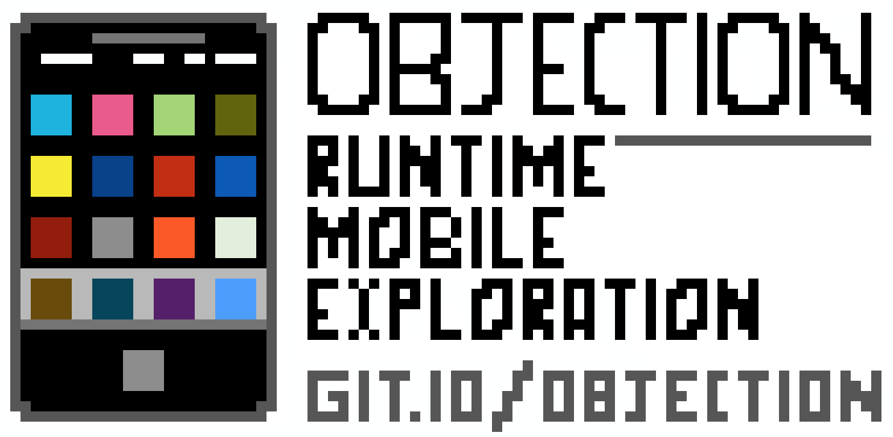

# 📱objection - Runtime Mobile Exploration

`objection` is a runtime mobile exploration toolkit, powered by [Frida](https://www.frida.re/), built to help you assess the security posture of your mobile applications, without needing a jailbreak.

- Supports both iOS and Android.
- Inspect and interact with container file systems.
- Bypass SSL pinning.
- Dump keychains.
- Perform memory related tasks, such as dumping & patching.
- Explore and manipulate objects on the heap.
- And much, much [more](https://github.com/sensepost/objection/wiki/Features)...

Screenshots are available in the [wiki](https://github.com/sensepost/objection/wiki/Screenshots).

## installation

Installation is simply a matter of `pip3 install objection`. This will give you the `objection` command. You can update an existing `objection` installation with `pip3 install --upgrade objection`.

For more detailed update and installation instructions, please refer to the wiki page [here](https://github.com/sensepost/objection/wiki/Installation).

## license

`objection` is licensed under a [GNU General Public v3 License](https://www.gnu.org/licenses/gpl-3.0.en.html). Permissions beyond the scope of this license may be available at [http://sensepost.com/contact/](http://sensepost.com/contact/).
