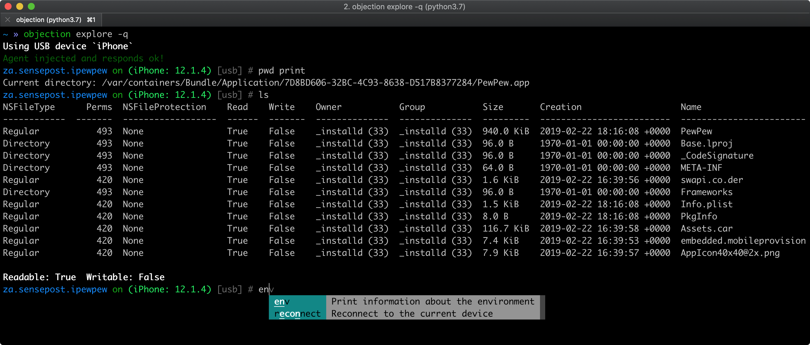

<h1 align="center">
   
  
   
  objection
   
</h1>

<h4 align="center">Runtime Mobile Exploration, powered by <a href="https://www.frida.re/" target="_blank">Frida</a>.</h4>

  
  

 

## introduction
`objection` is a runtime mobile exploration toolkit, powered by [Frida](https://www.frida.re/). It was built with the aim of helping assess mobile applications and their security posture without the need for a jailbroken or rooted mobile device.

The project's name quite literally explains the approach as well, whereby runtime specific objects are injected into a running process and executed using Frida.

**Note:** This is not some form of jailbreak / root bypass. By using `objection`, you are still limited by all of the restrictions imposed by the applicable sandbox you are facing.

## features
Supporting both iOS and Android and having new features and improvements added regularly as the tool is used in real world scenarios, the following is a short list of only a few key features:

For all supported platforms, `objection` allows you to:

- Patch iOS and Android applications, embedding a Frida gadget that can be used with `objection` or just Frida itself.
- Interact with the filesystem, listing entries as well as upload & download files where permitted.
- Perform various memory related tasks, such as listing loaded modules and their respective exports.
- Attempt to bypass and simulate jailbroken or rooted environments.
- Discover loaded classes and list their respective methods.
- Perform common SSL pinning bypasses.
- Dynamically dump arguments from methods called as you use the target application.
- Interact with SQLite databases inline without the need to download the targeted database and use an external tool.
- Execute custom Frida scripts.

iOS specific features in `objection` include the ability to:

- Dump the iOS keychain, and export it to a file.
- Dump data from common storage such as NSUserDefaults and the shared NSHTTPCookieStorage.
- Dump various formats of information in human readable forms.
- Bypass certain forms of TouchID restrictions.
- Watch for method executions by targeting all methods in a class, or just a single method.
- Monitor the iOS pasteboard.
- Dump encoded `.plist` files in a human readable format without relying on external parsers.

Android specific features in `objection` include the ability to:

- List the applications Activities, Services and Broadcast receivers.
- Start arbitrary Activities available in the target application.
- Watch a class method, reporting execution as it happens.

## screenshots
The following screenshots show the main `objection` repl, connected to a test application on both an iPad running iOS 10.2.1, and Samsung Galaxy S5 running Android 6.

#### A file system listing of the iOS applications main bundle

#### A file system listing of the Android applications bundle

#### iOS Keychain dumped for the current application, and later written to a file called `keychain.json`

#### Inline SQLite query tool

#### SSL Pinning bypass running for an iOS application

#### SSL Pinning bypass running for an Android application

## sample usage
A sample session, where `objection` version 0.1 is used to explore the applications environment. Newer versions have the REPL prompt set to the current applications name, however usage has remained the same:

## prerequisites
To run `objection`, all you need is the python3 interpreter to be available. Installation via `pip` should take care of all of the dependencies needed. For more details, please see the [prerequisites](https://github.com/sensepost/objection/wiki/Installation#prerequisites) section on the project wiki.

As for the target mobile applications though, for iOS, an unencrypted IPA is needed and Android just the normal APK should be fine. If you have the source code of the iOS application you want to explore, then you can simply embed and load the `FridaGadget.dylib` from within the Xcode project.

## installation
Installation is simply a matter of `pip3 install objection`. This will give you the `objection` command.

For more detailed update and installation instructions, please refer to the wiki page [here](https://github.com/sensepost/objection/wiki/Installation).

## powered by

## license

Objection is licensed under a [Creative Commons Attribution-NonCommercial-ShareAlike 4.0 International License](http://creativecommons.org/licenses/by-nc-sa/4.0/) Permissions beyond the scope of this license may be available at http://sensepost.com/contact/.
